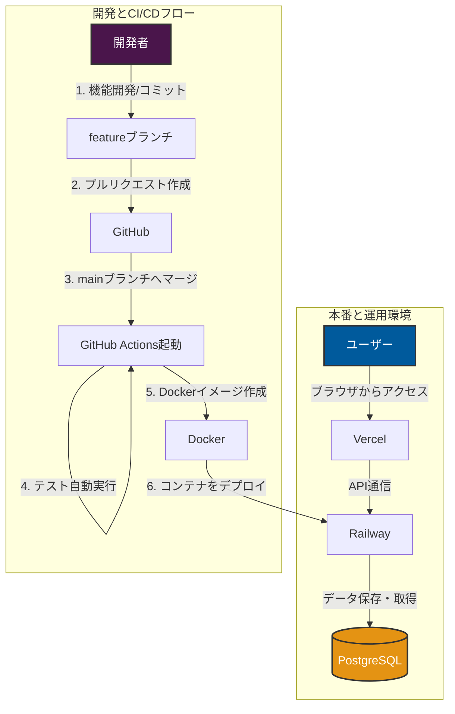

# スキルシート作成ページ（フルスタック版）

&nbsp;

[【 サイトはこちら 】](https://full-stack-create-skill-sheet.vercel.app/#/)

実装済：IDでのURL共有機能、期限付共有URL化  
実装予定：PDF出力API、集計機能、WebHook追加機能

&nbsp;

## 概要

本アプリは、就職活動における自己PRや、社内メンバーの技術レベルを効率的に把握・管理することを目的としたスキルシート作成ツールです。
元々フロントエンド（Vue3 + TypeScript）で制作したシステムに対し、実務運用を想定した機能拡張を行うため、バックエンド（Spring Boot）およびデータベースを接続してフルスタックな構成へと刷新しました。

[【 旧開発リポジトリ（フロントエンド） 】](https://github.com/masa2401/CreateYourSkillSheet)

## システム構成図（アーキテクチャ）



## 本アプリのこだわり（実務・運用を意識した取り組み）

- **フロントエンドの疎結合設計と保守性の向上**
  - 将来的な仕様変更や機能拡張にも対応できるよう、関数の切り出しやコンポーネントの疎結合化を行い、コードの可読性を高めたり、修正作業の影響範囲を最小限に抑える設計を意識しました。

- **TypeScript導入による、スムーズなAPI連携**
  - フロントエンドに型定義を導入し、バックエンドとのデータ構造の不整合を未然に防ぐことができ、API連携の時に修正作業を最小限にすることが出来ました。

- **CI/CDの構築と自動テスト**
  - コード品質を保つため、フロント・バックエンド両方に自動テスト（Vitest / JUnit等）を導入しました。モックを活用したコンポーネントの動作確認や、関数の正常・異常系チェックといった単体テストをGitHub Actionsで自動実行する環境を構築しました。

- **デプロイ最適化とコスト削減**
  - インフラにはVercel（フロント）とRailway（バックエンド）を採用。初期はRailway側で毎回Buildを行っていたため、メモリ消費量が大きかったのですが、GitHub Actions側でDockerコンテナをBuild/Pushし、デプロイ先ではコンテナの展開のみを行う構成へと変更。メモリ消費を抑えた効率的なインフラ運用（コスト削減）を実現しました。
- **GitHub Projectsを活用したプロジェクト管理**
  - 実務におけるチーム開発やタスク管理の流れを意識し、GitHub Projectsを用いてIssueを管理することで、アジャイル開発の流れを開発に取り入れています。

### 使用技術

#### フロントエンド


#### バックエンド


#### インフラ / その他


## ディレクトリ構造

```text
root/
├── spring-backend/      # バックエンド（Spring Boot）
│   └── src/
│       ├── main/
│       │   └── java/com/skillsheet/
│       │       ├── config/                      # 各種設定クラス
│       │       ├── controller/                  # APIエンドポイント
│       │       ├── dto/                         # データ転送オブジェクト
│       │       ├── entity/                      # DBテーブル連携用クラス
│       │       ├── exception/                   # 例外処理
│       │       ├── repository/                  # DBアクセス機能
│       │       ├── service/                     # ビジネスロジック
│       │       └── SkillSheetApplication.java   # 起動クラス
│       └── test/                                # テストコード
├── vue-frontend/                                # フロントエンド
└── README.md                                    # 本ファイル
```

## 機能詳細、苦労した部分

### ID(UUID)によるURL共有機能

1. フロント・バックエンド間のデータ構造の変換  
   フロントエンドの状態管理（Pinia等）に依存するオブジェクト構造と、バックエンドが要求するAPIのデータ構造（DTO）を分離・変換する処理の構築に工夫が必要でした。
   フロント側できちんと型を定義し、API通信専用のインターフェースへ変換する層を設けたことで、スムーズなAPI連携を実現することができました。

2. 二重送信（多重送信）の防止と不整合データの排除  
   初期の実装では、ボタンの連打等によってDBに対して同一データの多重送信が発生してしまう問題がありました。
   対策として、フロントエンド側でAPI通信の制御（状態管理や初回送信のみの制限）を行うようロジックを修正。不要な通信をカットしつつ、DBへの重複保存のバグを解消することが出来ました。

## 今後の展望（ロードマップ）

追加機能の一部をAWS Lambda等へ切り出し、外部APIとしてサーバーレスアーキテクチャ化を計画中。サーバーレス運用を通じた、モダンなバックエンド設計の学習を目標としています。
