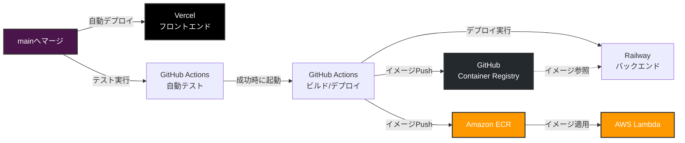
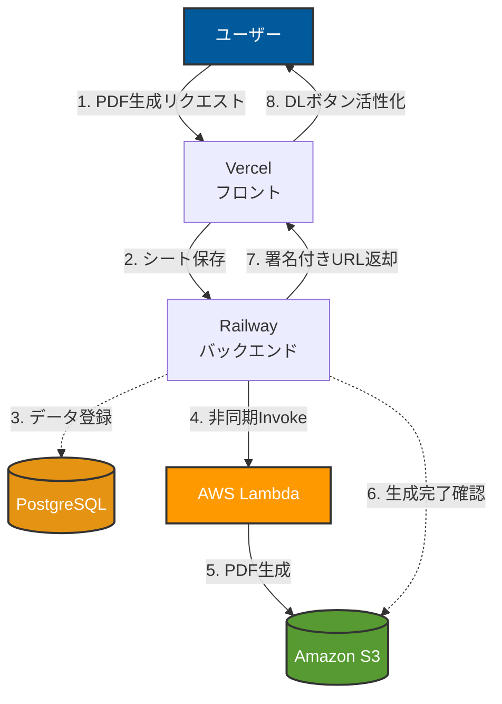

# スキルシート作成ページ（フルスタック版）

&nbsp;

[【 サイトはこちら 】](https://full-stack-create-skill-sheet.vercel.app/#/)

&nbsp;

## 概要

本アプリは、就職活動における自己PRや、社内メンバーの技術レベルを効率的に把握・管理することを目的としたスキルシート作成ツールです。  
元々フロントエンド（Vue3 + TypeScript）で制作したシステムに対し、実務運用を想定した機能拡張を行うため、バックエンド（Spring Boot）およびデータベースを接続してフルスタックな構成へと刷新しました。

[【 旧開発リポジトリ（フロントエンド） 】](https://github.com/masa2401/CreateYourSkillSheet)

## 本アプリで意識したポイント

- ユーザーの操作を止めない、段階的な機能制限とUIによる操作誘導
- ユーザーの入力タイミングを活用した、Lambdaのコールドスタート対策
- VitestとPlaywrightの適材適所での使い分けによるテスト自動化
- フロント・バックエンド間の型安全性を意識したデータ設計
- Lambda上でのPuppeteer実行環境の構築（日本語フォントの文字化け対策など）

## 使用技術

### フロントエンド

### バックエンド

### インフラ / その他

## システム構成（アーキテクチャ）図

### デプロイフロー

```mermaid
graph LR
    Merge[mainへマージ]
    Vercel[Vercel<br>フロントエンド]
    Test[GitHub Actions<br>自動テスト]
    Deploy[GitHub Actions<br>ビルド/デプロイ]
    GHCR[GitHub<br>Container Registry]
    Railway[Railway<br>バックエンド]
    ECR[Amazon ECR]
    Lambda[AWS Lambda]

    Merge -->|自動デプロイ| Vercel

    Merge -->|テスト実行| Test
    Test -->|成功時に起動| Deploy

    Deploy -->|イメージPush| GHCR
    Deploy -->|デプロイ実行| Railway
    GHCR -.->|イメージ参照| Railway

    Deploy -->|イメージPush| ECR
    ECR -->|イメージ適用| Lambda

    %% スタイルの設定
    style Merge fill:#4A154B,stroke:#333,stroke-width:2px,color:#fff
    style Vercel fill:#000000,stroke:#333,stroke-width:2px,color:#fff
    style GHCR fill:#24292e,stroke:#333,stroke-width:2px,color:#fff
    style ECR fill:#FF9900,stroke:#333,stroke-width:2px,color:#fff
    style Lambda fill:#FF9900,stroke:#333,stroke-width:2px,color:#fff
```

### PDF生成の処理フロー

```mermaid
graph TD
    User[ユーザー]
    Vercel[Vercel<br>フロント]
    Railway[Railway<br>バックエンド]
    DB[(PostgreSQL)]
    Lambda[AWS Lambda]
    S3[(Amazon S3)]

    User -->|1. PDF生成リクエスト| Vercel
    Vercel -->|2. シート保存| Railway
    Railway -.->|3. データ登録| DB
    Railway -->|4. 非同期Invoke| Lambda
    Lambda -->|5. PDF生成| S3
    Railway -.->|6. 生成完了確認| S3
    Railway -->|7. 署名付きURL返却| Vercel
    Vercel -->|8. DLボタン活性化| User

    %% スタイルの設定
    style User fill:#005A9C,stroke:#333,stroke-width:2px,color:#fff
    style DB fill:#E49313,stroke:#333,stroke-width:2px,color:#fff
    style Lambda fill:#FF9900,stroke:#333,stroke-width:2px,color:#fff
    style S3 fill:#569A31,stroke:#333,stroke-width:2px,color:#fff
```

## 設計ノート

実装で行った設計判断とその背景は [DESIGN_NOTES.md](./DESIGN_NOTES.md) にまとめています。
