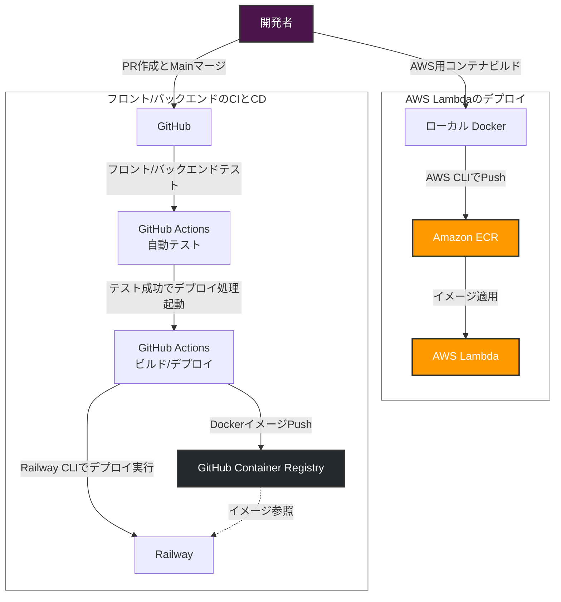
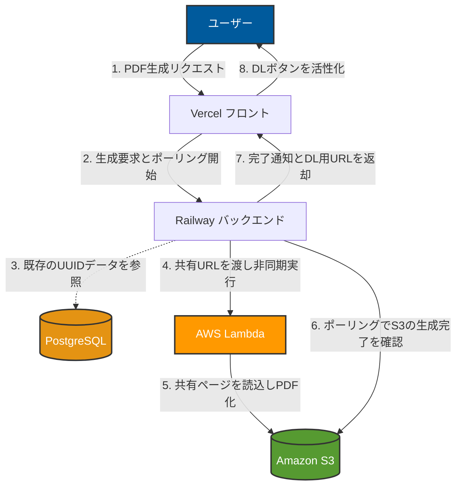

# スキルシート作成ページ（フルスタック版）

&nbsp;

[【 サイトはこちら 】](https://full-stack-create-skill-sheet.vercel.app/#/)

&nbsp;

## 概要

本アプリは、就職活動における自己PRや、社内メンバーの技術レベルを効率的に把握・管理することを目的としたスキルシート作成ツールです。  
元々フロントエンド（Vue3 + TypeScript）で制作したシステムに対し、実務運用を想定した機能拡張を行うため、バックエンド（Spring Boot）およびデータベースを接続してフルスタックな構成へと刷新しました。

[【 旧開発リポジトリ（フロントエンド） 】](https://github.com/masa2401/CreateYourSkillSheet)

## 本アプリで意識したポイント

- 型安全性を活かし、データ受け渡し時のミスを減らす設計
- 自動テストとCIによる継続的な品質確認
- GitHub Actionsで事前ビルドを行い、コストと保守性を考慮したデプロイ構成
- UUIDを利用した推測されにくい共有URL設計
- AWS Lambda・Dockerを利用したサーバーレスPDF生成
- GitHub Projectsを用いた開発フローの管理

## 使用技術

### フロントエンド

### バックエンド

### インフラ / その他

## システム構成（アーキテクチャ）図

### 開発・デプロイフロー

```mermaid
%%{init: {"themeVariables": {"clusterBkg": "transparent", "clusterBorder": "#777"}}}%%
graph TD
    Developer[開発者]

    subgraph LambdaDeploy [AWS Lambdaのデプロイ]
        LocalDocker[ローカル Docker]
        ECR[Amazon ECR]
        Lambda[AWS Lambda]
    end

    subgraph AppDeploy [フロント/バックエンドのCIとCD]
        GitHub[GitHub]
        GHATest[GitHub Actions<br>自動テスト]
        GHADeploy[GitHub Actions<br>ビルド/デプロイ]
        GHCR[GitHub Container Registry]
        Railway[Railway]
    end

    %% アプリ本体のデプロイフロー
    Developer -->|PR作成とMainマージ| GitHub
    GitHub -->|フロント/バックエンドテスト| GHATest
    GHATest -->|テスト成功でデプロイ処理起動| GHADeploy
    GHADeploy -->|DockerイメージPush| GHCR
    GHADeploy -->|Railway CLIでデプロイ実行| Railway
    GHCR -.->|イメージ参照| Railway

    %% AWS Lambdaのデプロイフロー
    Developer -->|AWS用コンテナビルド| LocalDocker
    LocalDocker -->|AWS CLIでPush| ECR
    ECR -->|イメージ適用| Lambda

    %% スタイルの設定
    style Developer fill:#4A154B,stroke:#333,stroke-width:2px,color:#fff
    style Lambda fill:#FF9900,stroke:#333,stroke-width:2px,color:#fff
    style ECR fill:#FF9900,stroke:#333,stroke-width:2px,color:#fff
    style GHCR fill:#24292e,stroke:#333,stroke-width:2px,color:#fff
```

### 本番環境・処理フロー

```mermaid
graph TD
    User[ユーザー]
    Vercel[Vercel フロント]
    Railway[Railway バックエンド]
    DB[(PostgreSQL)]
    Lambda[AWS Lambda]
    S3[(Amazon S3)]

    User -->|1. PDF生成リクエスト| Vercel
    Vercel -->|2. 生成要求とポーリング開始| Railway
    Railway -.->|3. 既存のUUIDデータを参照| DB
    Railway -->|4. 共有URLを渡し非同期実行| Lambda
    Lambda -->|5. 共有ページを読込しPDF化| S3
    Railway -->|6. ポーリングでS3の生成完了を確認| S3
    Railway -->|7. 完了通知とDL用URLを返却| Vercel
    Vercel -->|8. DLボタンを活性化| User

    %% スタイルの設定
    style User fill:#005A9C,stroke:#333,stroke-width:2px,color:#fff
    style DB fill:#E49313,stroke:#333,stroke-width:2px,color:#fff
    style Lambda fill:#FF9900,stroke:#333,stroke-width:2px,color:#fff
    style S3 fill:#569A31,stroke:#333,stroke-width:2px,color:#fff
```

## 技術的な工夫と設計判断

### IDによるURL共有機能

- #### UUID採用によるデータ保護

  課題：連番IDだと、IDの書き換えだけで他人のデータにアクセスできてしまう  
  検討：ハッシュ化やアクセストークンによる認可も選択肢にあったが、共有機能の性質上「URLを知っている人だけが見られればよい」という要件のため、認証機構までは過剰と判断  
  採用：予測不可能なUUIDをIDとして採用し、共有URLの推測を困難に  
  結果：実装コストを抑えつつ、他者データへの不正アクセスリスクを排除

### 期限付き共有URL化とライフサイクル管理

- #### ステータスコード（410/404）によるエラーハンドリング

  課題：期限切れ直後とDB削除後で、フロント側の表示が区別できない  
  解決：バックエンドで`LocalDateTime.now()`と比較し、期限切れ直後は410、DB削除後は404を返却  
  結果：データの状態に応じた適切なエラーメッセージをUI側で切り分け可能に

- #### @Scheduledによる自動クリーンアップ

  課題：不要なデータがDBに残り続けると、ストレージ圧迫・インフラコスト増大につながる  
  対策：`@Scheduled`（Cron）で期限切れデータを定期的に自動削除  
  結果：手動運用不要のデータライフサイクル管理を実現

### AWS Lambda + Puppeteer による非同期PDF生成機能

- #### 既存機能を活用したPDF生成設計

  課題：PDF描画用のロジックをゼロから作ると開発コストが大きい  
  対策：既存の「URL共有機能」の画面をLambda側のPuppeteerで読み込み、そのままPDF化  
  結果：実装コストを抑えつつ、表示内容と出力PDFの一貫性を担保

- #### 非同期PDF生成の完了検知設計

  課題：Lambda上で非同期処理で実行しているため、呼び出し元は生成の成否を直接受け取れない  
  検討：Webhookによる完了通知も考慮したが、Lambda側のインフラ追加（SNS/SQS等）が必要になりコストと複雑性が増す  
  採用：S3への出力を完了とみなし、ポーリングで検知する設計を採用  
  結果：追加のインフラなしで非同期処理の完了通知を実現

- #### Puppeteerのコンテナ化とデプロイ

  課題：Lambda環境でPuppeteerを安定動作させるには、依存ライブラリを含めた環境構築が必要。特に日本語フォント表示は軽量ランタイム（@sparticuz/chromium）ではシステムのfontconfigが反映されず崩れることが判明  
  検討：軽量ランタイムでのフォント埋め込み対応も試みたが、安定した日本語表示を優先し、フル版Puppeteer（Chrome for Testing）を採用する方針に転換  
  対策：Dockerでコンテナ化し、ローカルビルド→Amazon ECR→Lambdaへ手動デプロイ  
  結果：サーバーレス運用の仕組みを一連の流れで理解・実践（現在自動化済）

### CI/CDパイプラインの構築とデプロイの最適化

- #### ビルド方式の見直しによる負荷の改善

  課題：バックエンド（Railway）側でビルドを行っており、メモリ消費が大きく課題だった  
  対策：GitHub Actions側でコンテナをビルド・Pushし、デプロイ先では展開のみを行う構成に変更  
  結果：メモリ消費を抑制し、デプロイ負荷を改善

### テストとCIによる品質担保

- #### アクセシビリティを軸にしたテスト設計

  課題：CSSクラス名に依存したテストは、見た目のリファクタのたびに壊れやすい  
  対策：`role`やネイティブ要素の状態（`checked`等）を基準にしたテストへ統一し、実装詳細への依存を排除  
  結果：スタイル変更時にテストの意図せぬ破損が起きにくい構成を実現

- #### カバレッジを指標にした網羅的なテスト

  課題：正常系だけのテストでは、非同期処理の競合状態やエラー分岐の不具合を見逃しやすい  
  対策：`vitest`でカバレッジを可視化し、95%以上を維持しながら、ネットワークエラー・ID切り替え時の競合状態などの分岐を重点的に検証  
  結果：カバレッジ改善の過程で実装側の潜在バグ（非activeな分岐の未処理等）を複数発見・修正

- #### テストフレームワークの使い分け（Vitest / Playwright）

  課題：全てのテストをVitest（happy-dom）で書くと、CSSの`:has()`セレクタ・Clipboard API・`localStorage`永続化・印刷用スタイルなど、実ブラウザでしか発生しない挙動を検証できない  
  検討：全テストをPlaywrightへ寄せる案もあったが、多分岐のロジック検証や値レベルの検証（emitされたペイロードの正しさ等）はE2Eでは特定が難しく、実行コストも増大する  
  採用：「実ブラウザ環境・実APIに依存するか」を基準に、ロジック検証はVitest、実描画・永続化・複数ページ遷移が絡む検証はPlaywrightへ切り分け  
  結果：それぞれのツールが得意な領域に責務を絞り、重複のない実行コストの低いテスト構成を実現

- #### 状態の直接注入によるE2E実行コストの最適化

  課題：CSVダウンロードや印刷スタイルなど「特定の画面状態」だけを検証したいテストでも、毎回トップ画面からのクリック操作で状態を作る必要があり、テストの実行時間と可読性を損なっていた  
  検討：全テストを一貫してUI操作で統一する案もあったが、遷移そのものを検証する意図のないテストにまでUI操作を強制する必要性は薄いと判断  
  採用：`pinia-plugin-persistedstate`の永続化構造を直接調査し、`localStorage`へ状態を注入した上で対象ページへ直接遷移する仕組みを導入。ページ遷移そのものを検証する専用テストのみ、実際のUI操作を維持  
  結果：検証したい対象に応じてテストの前提構築コストを最小化し、実行時間と可読性を両立
