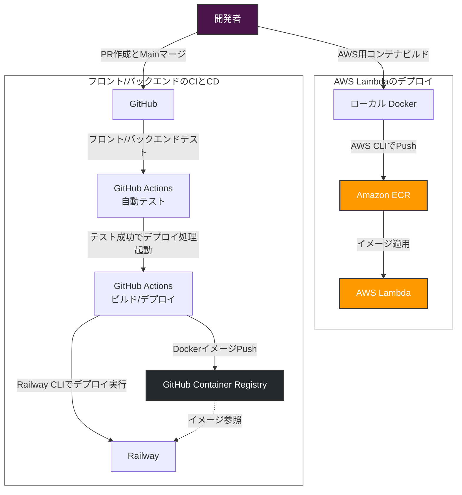
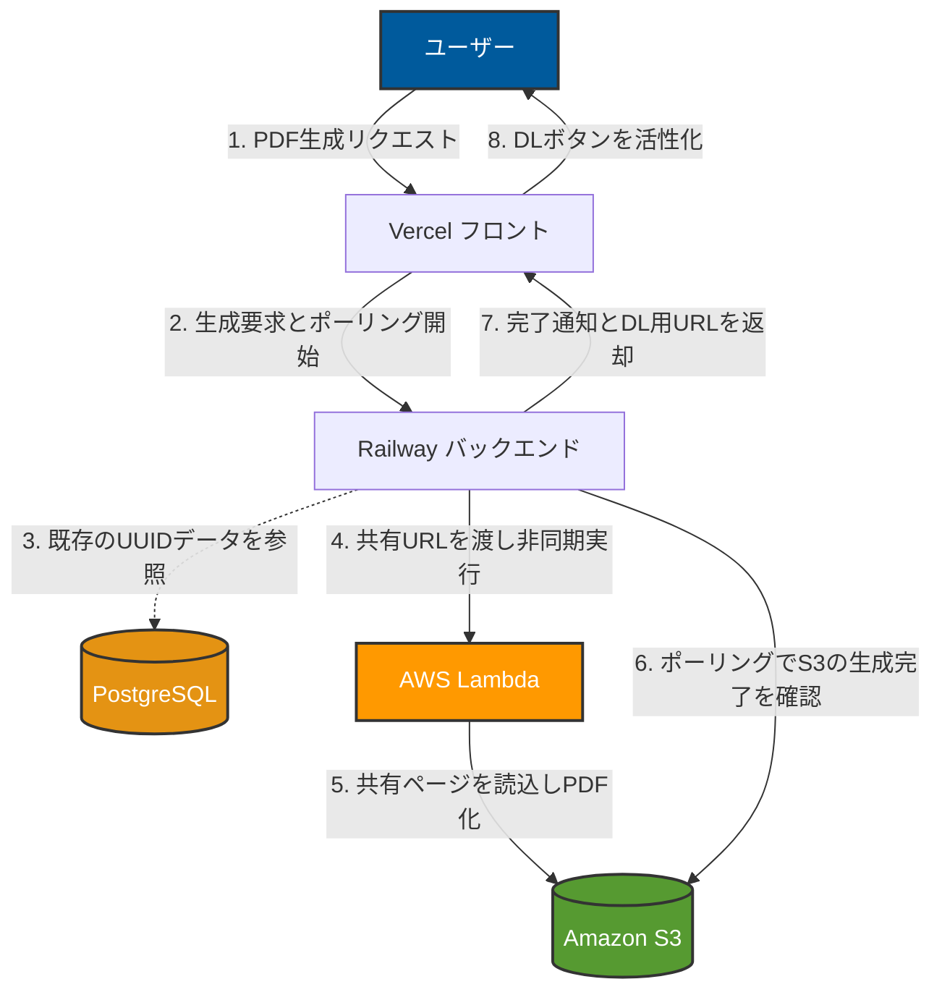

# スキルシート作成ページ（フルスタック版）

&nbsp;

[【 サイトはこちら 】](https://full-stack-create-skill-sheet.vercel.app/#/)

&nbsp;

## 概要

本アプリは、就職活動における自己PRや、社内メンバーの技術レベルを効率的に把握・管理することを目的としたスキルシート作成ツールです。  
元々フロントエンド（Vue3 + TypeScript）で制作したシステムに対し、実務運用を想定した機能拡張を行うため、バックエンド（Spring Boot）およびデータベースを接続してフルスタックな構成へと刷新しました。

[【 旧開発リポジトリ（フロントエンド） 】](https://github.com/masa2401/CreateYourSkillSheet)

## 本アプリで意識したポイント

- ユーザーの操作を止めない、段階的な機能制限とUIによる操作誘導
- ユーザーの入力タイミングを活用した、Lambdaのコールドスタート対策
- VitestとPlaywrightの適材適所での使い分けによるテスト自動化
- フロント・バックエンド間の型安全性を意識したデータ設計
- Lambda上でのPuppeteer実行環境の構築（日本語フォントの文字化け対策など）
- UUIDによる推測されにくい共有URL設計、GitHub Actionsでの自動デプロイ など

## 使用技術

### フロントエンド

### バックエンド

### インフラ / その他

## システム構成（アーキテクチャ）図

### 開発・デプロイフロー

```mermaid
%%{init: {"themeVariables": {"clusterBkg": "transparent", "clusterBorder": "#777"}}}%%
graph TD
    Developer[開発者]

    subgraph LambdaDeploy [AWS Lambdaのデプロイ]
        LocalDocker[ローカル Docker]
        ECR[Amazon ECR]
        Lambda[AWS Lambda]
    end

    subgraph AppDeploy [フロント/バックエンドのCIとCD]
        GitHub[GitHub]
        GHATest[GitHub Actions<br>自動テスト]
        GHADeploy[GitHub Actions<br>ビルド/デプロイ]
        GHCR[GitHub Container Registry]
        Railway[Railway]
    end

    %% アプリ本体のデプロイフロー
    Developer -->|PR作成とMainマージ| GitHub
    GitHub -->|フロント/バックエンドテスト| GHATest
    GHATest -->|テスト成功でデプロイ処理起動| GHADeploy
    GHADeploy -->|DockerイメージPush| GHCR
    GHADeploy -->|Railway CLIでデプロイ実行| Railway
    GHCR -.->|イメージ参照| Railway

    %% AWS Lambdaのデプロイフロー
    Developer -->|AWS用コンテナビルド| LocalDocker
    LocalDocker -->|AWS CLIでPush| ECR
    ECR -->|イメージ適用| Lambda

    %% スタイルの設定
    style Developer fill:#4A154B,stroke:#333,stroke-width:2px,color:#fff
    style Lambda fill:#FF9900,stroke:#333,stroke-width:2px,color:#fff
    style ECR fill:#FF9900,stroke:#333,stroke-width:2px,color:#fff
    style GHCR fill:#24292e,stroke:#333,stroke-width:2px,color:#fff
```

### 本番環境・処理フロー

```mermaid
graph TD
    User[ユーザー]
    Vercel[Vercel フロント]
    Railway[Railway バックエンド]
    DB[(PostgreSQL)]
    Lambda[AWS Lambda]
    S3[(Amazon S3)]

    User -->|1. PDF生成リクエスト| Vercel
    Vercel -->|2. 生成要求とポーリング開始| Railway
    Railway -.->|3. 既存のUUIDデータを参照| DB
    Railway -->|4. 共有URLを渡し非同期実行| Lambda
    Lambda -->|5. 共有ページを読込しPDF化| S3
    Railway -->|6. ポーリングでS3の生成完了を確認| S3
    Railway -->|7. 完了通知とDL用URLを返却| Vercel
    Vercel -->|8. DLボタンを活性化| User

    %% スタイルの設定
    style User fill:#005A9C,stroke:#333,stroke-width:2px,color:#fff
    style DB fill:#E49313,stroke:#333,stroke-width:2px,color:#fff
    style Lambda fill:#FF9900,stroke:#333,stroke-width:2px,color:#fff
    style S3 fill:#569A31,stroke:#333,stroke-width:2px,color:#fff
```

## 技術的な工夫と設計判断

### 状態に応じた段階的な機能制限

- #### aria-disabled によるアクセシブルな操作誘導

  課題：名前未入力のゲスト状態でも結果画面の閲覧は許可しつつ、共有・印刷などデータに紐づく操作は制限したい。ただしnativeの`disabled`属性ではhover/focusイベントが発火せず、ツールチップで操作方法を案内できない  
  検討：都度モーダルで確認する方式も検討したが、ユーザーの操作フローを毎回中断させてしまい体験を損なうと判断  
  採用：`aria-disabled`属性で視覚的・意味的な無効化のみを行い、hover/focus/Esc/外側クリックを検知する専用コンポーザブル（`useGuestGate`）でツールチップによる誘導を実装。誘導リンクから名前入力欄へスクロール＋一時ハイライトする導線も追加  
  結果：ユーザーの操作を止めずに次のアクションを提示できる、アクセシビリティにも配慮したUI制御に

### Lambdaコールドスタートを見越したプリフェッチ設計

- #### 名前入力確定をトリガーにした先行保存

  課題：PDF生成をAWS Lambda（Puppeteer）で非同期実行しているため、コールドスタート時のレイテンシがユーザー体験を損なう  
  検討：Provisioned Concurrencyでの常時起動も検討したが、アクセス頻度の低いポートフォリオ用途ではコストに見合わないと判断  
  採用：結果ページでの名前入力確定を「ユーザーが結果を読んでいる自然な時間」とみなし、そのタイミングでシート保存（PDF生成のトリガーとなるバックエンド処理）を先行実行  
  結果：追加インフラを増やさずに、コールドスタートの待ち時間をユーザーの自然な操作時間に吸収させる設計

### テストとCIによる品質向上

- #### アクセシビリティを軸にしたテスト設計

  課題：CSSクラス名に依存したテストは、見た目のリファクタのたびに壊れやすい  
  対策：`role`やネイティブ要素の状態（`checked`等）を基準にしたテストへ統一し、実装詳細への依存を排除  
  結果：スタイル変更時にテストの意図せぬ破損が起きにくい構成を実現

- #### テストフレームワークの使い分け（Vitest / Playwright）

  課題：全てのテストをVitest（happy-dom）で書くと、CSSの`:has()`セレクタ・Clipboard API・`localStorage`永続化・印刷用スタイルなど、実ブラウザでしか発生しない挙動を検証できない  
  検討：全テストをPlaywrightへ寄せる案もあったが、多分岐のロジック検証や値レベルの検証（emitされたペイロードの正しさ等）はE2Eでは特定が難しく、実行コストも増大する  
  採用：「実ブラウザ環境・実APIに依存するか」を基準に、ロジック検証はVitest、実描画・永続化・複数ページ遷移が絡む検証はPlaywrightへ切り分け  
  結果：それぞれのツールが得意な領域に責務を絞り、重複のない実行コストの低いテスト構成にまとめた

- #### 状態の直接注入によるE2E実行コストの最適化

  課題：CSVダウンロードや印刷スタイルなど「特定の画面状態」だけを検証したいテストでも、毎回トップ画面からのクリック操作で状態を作る必要があり、テストの実行時間と可読性を損なっていた  
  検討：全テストを一貫してUI操作で統一する案もあったが、遷移そのものを検証する意図のないテストにまでUI操作を強制する必要性は薄いと判断  
  採用：`pinia-plugin-persistedstate`の永続化構造を直接調査し、`localStorage`へ状態を注入した上で対象ページへ直接遷移する仕組みを導入。ページ遷移そのものを検証する専用テストのみ、実際のUI操作を維持  
  結果：検証したい対象に応じてテストの前提構築コストを最小化し、実行時間と可読性を両立

### AWS Lambda + Puppeteer による非同期PDF生成機能

- #### 非同期PDF生成の完了検知設計

  課題：Lambda上で非同期処理として実行しているため、呼び出し元は生成の成否を直接受け取れない  
  検討：Webhookによる完了通知も考慮したが、Lambda側のインフラ追加（SNS/SQS等）が必要になりコストと複雑性が増す  
  採用：S3への出力を完了とみなし、ポーリングで検知する設計を採用  
  結果：追加のインフラなしで非同期処理の完了を検知できる仕組みに

- #### Puppeteerのコンテナ化とデプロイ

  課題：Lambda環境でPuppeteerを安定動作させるには、依存ライブラリを含めた環境構築が必要。特に日本語フォント表示は軽量ランタイム（@sparticuz/chromium）ではシステムのfontconfigが反映されず崩れることが判明  
  検討：軽量ランタイムでのフォント埋め込み対応も試みたが、安定した日本語表示を優先し、フル版Puppeteer（Chrome for Testing）を採用する方針に転換  
  対策：Dockerでコンテナ化し、ローカルビルド→Amazon ECR→Lambdaへ手動デプロイ  
  結果：サーバーレス運用の仕組みを一連の流れで理解・実践（現在自動化済）

### その他の設計判断（バックエンド／インフラ）

- **UUIDによる共有IDの設計**：連番IDの推測リスクを避け、予測不可能なUUIDを採用
- **共有URLのライフサイクル管理**：期限切れ（410）とDB削除後（404）をステータスコードで判別し、`@Scheduled`で不要データを自動クリーンアップ
- **既存の共有画面を活用したPDF生成**：新規描画ロジックを作らず、既存機能を流用して実装コストと表示の一貫性を両立
- **CI/CDのビルド最適化**：GitHub Actions側でコンテナビルドを行い、デプロイ先の負荷を軽減
