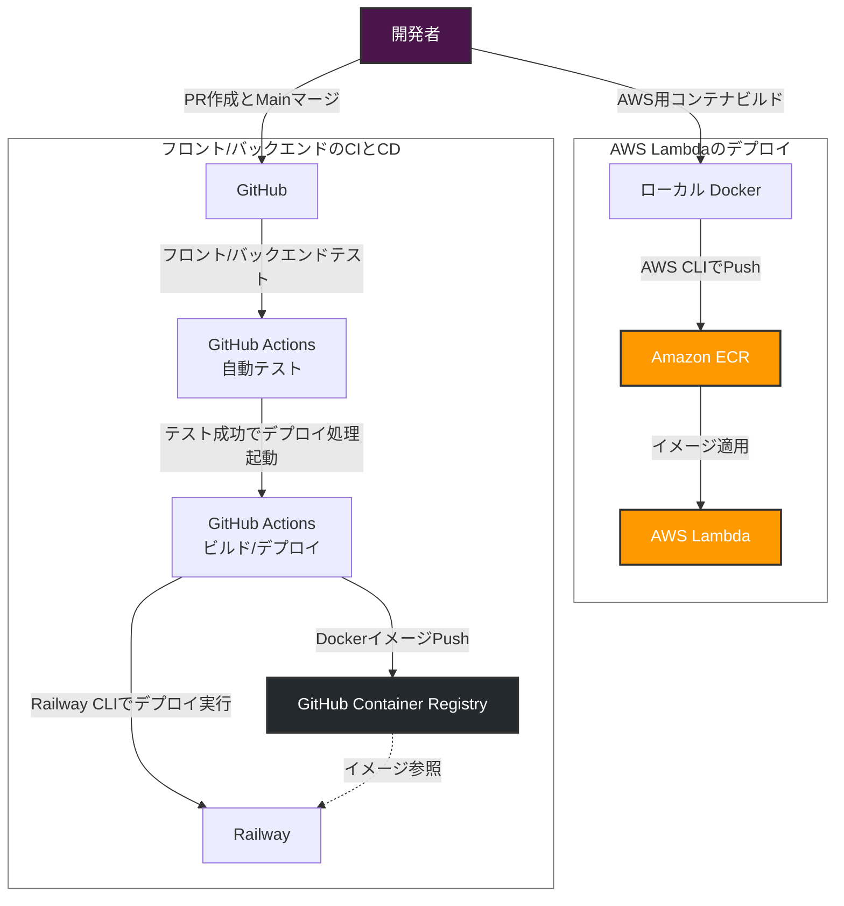
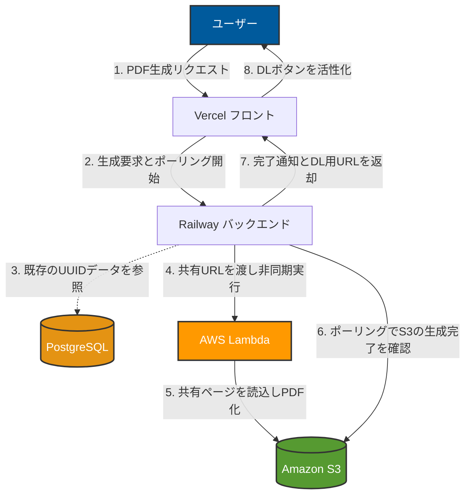

# スキルシート作成ページ（フルスタック版）

&nbsp;

[【 サイトはこちら 】](https://full-stack-create-skill-sheet.vercel.app/#/)

実装済：IDでのURL共有機能、期限付共有URL化、AWS LambdaによるPDF出力機能  
実装予定：集計機能、WebHook追加機能、AWSデプロイのCI/CD自動化

&nbsp;

## 概要

本アプリは、就職活動における自己PRや、社内メンバーの技術レベルを効率的に把握・管理することを目的としたスキルシート作成ツールです。  
元々フロントエンド（Vue3 + TypeScript）で制作したシステムに対し、実務運用を想定した機能拡張を行うため、バックエンド（Spring Boot）およびデータベースを接続してフルスタックな構成へと刷新しました。

[【 旧開発リポジトリ（フロントエンド） 】](https://github.com/masa2401/CreateYourSkillSheet)

## 本アプリのこだわり（実務・運用を意識した取り組み）

- **バグを未然に防ぐ設計**：TypeScript / Javaの型定義により、データのやり取りで起きるミスを事前に防止
- **品質を担保するテスト体制**：Vitest / JUnitによる自動テストと、GitHub Actionsでの自動実行を整備
- **コストと運用効率への意識**：インフラ構成を見直し、無駄なリソース消費を削減
- **セキュリティ意識**：他人のデータへ推測アクセスできない設計を採用
- **最新技術へのキャッチアップ**：サーバーレス（AWS Lambda）やコンテナ技術（Docker）を用いた設計にも挑戦
- **チーム開発を意識したプロジェクト設計**：GitHub Projectsでタスクを可視化し、実務に近い開発フローを構築

## システム構成（アーキテクチャ）図

### 開発・デプロイフロー


```mermaid
%%{init: {"themeVariables": {"clusterBkg": "transparent", "clusterBorder": "#777"}}}%%
graph TD
    Developer[開発者]

    subgraph LambdaDeploy [AWS Lambdaのデプロイ]
        LocalDocker[ローカル Docker]
        ECR[Amazon ECR]
        Lambda[AWS Lambda]
    end

    subgraph AppDeploy [フロント/バックエンドのCIとCD]
        GitHub[GitHub]
        GHATest[GitHub Actions<br>自動テスト]
        GHADeploy[GitHub Actions<br>ビルド/デプロイ]
        GHCR[GitHub Container Registry]
        Railway[Railway]
    end

    %% アプリ本体のデプロイフロー
    Developer -->|PR作成とMainマージ| GitHub
    GitHub -->|フロント/バックエンドテスト| GHATest
    GHATest -->|テスト成功でデプロイ処理起動| GHADeploy
    GHADeploy -->|DockerイメージPush| GHCR
    GHADeploy -->|Railway CLIでデプロイ実行| Railway
    GHCR -.->|イメージ参照| Railway

    %% AWS Lambdaのデプロイフロー
    Developer -->|AWS用コンテナビルド| LocalDocker
    LocalDocker -->|AWS CLIでPush| ECR
    ECR -->|イメージ適用| Lambda

    %% スタイルの設定
    style Developer fill:#4A154B,stroke:#333,stroke-width:2px,color:#fff
    style Lambda fill:#FF9900,stroke:#333,stroke-width:2px,color:#fff
    style ECR fill:#FF9900,stroke:#333,stroke-width:2px,color:#fff
    style GHCR fill:#24292e,stroke:#333,stroke-width:2px,color:#fff
```

### 本番環境・処理フロー


```mermaid
graph TD
    User[ユーザー]
    Vercel[Vercel フロント]
    Railway[Railway バックエンド]
    DB[(PostgreSQL)]
    Lambda[AWS Lambda]
    S3[(Amazon S3)]

    User -->|1. PDF生成リクエスト| Vercel
    Vercel -->|2. 生成要求とポーリング開始| Railway
    Railway -.->|3. 既存のUUIDデータを参照| DB
    Railway -->|4. 共有URLを渡し非同期実行| Lambda
    Lambda -->|5. 共有ページを読込しPDF化| S3
    Railway -->|6. ポーリングでS3の生成完了を確認| S3
    Railway -->|7. 完了通知とDL用URLを返却| Vercel
    Vercel -->|8. DLボタンを活性化| User

    %% スタイルの設定
    style User fill:#005A9C,stroke:#333,stroke-width:2px,color:#fff
    style DB fill:#E49313,stroke:#333,stroke-width:2px,color:#fff
    style Lambda fill:#FF9900,stroke:#333,stroke-width:2px,color:#fff
    style S3 fill:#569A31,stroke:#333,stroke-width:2px,color:#fff
```

### 使用技術

#### フロントエンド


#### バックエンド


#### インフラ / その他


## ディレクトリ構造

```text
root/
├── spring-backend/      # バックエンド（Spring Boot）
│   └── src/
│       ├── main/
│       │   └── java/com/skillsheet/
│       │       ├── config/                      # 各種設定クラス
│       │       ├── controller/                  # APIエンドポイント
│       │       ├── dto/                         # データ転送オブジェクト
│       │       ├── entity/                      # DBテーブル連携用クラス
│       │       ├── exception/                   # 例外処理
│       │       ├── repository/                  # DBアクセス機能
│       │       ├── service/                     # ビジネスロジック
│       │       └── SkillSheetApplication.java   # 起動クラス
│       └── test/                                # テストコード
├── vue-frontend/                                # フロントエンド
└── README.md                                    # 本ファイル
```

## 機能詳細、苦労した部分

### IDによるURL共有機能

- #### フロント・バックエンド間のデータ構造の変換
  - **【課題】** フロントエンドの状態管理（Pinia等）に依存するオブジェクト構造と、バックエンドが要求するAPIのデータ構造（DTO）の不一致。
  - **【解決策】** フロントエンド側で適切に型定義を行い、API通信専用のインターフェースへ変換する層を構築。**スムーズなAPI連携**を実現。

- #### 二重送信（多重送信）の防止と不整合データの排除

  初期の実装では、ボタンの連打等によってDBに対して同一データの多重送信が発生してしまう問題がありました。
  対策として、フロントエンド側でAPI通信の制御（状態管理や初回送信のみの制限）を行うようロジックを修正。不要な通信をカットしつつ、DBへの重複保存のバグを解消しました。

- #### UUID採用による他者データの閲覧・推測防止

  初期の個人利用を想定したフェーズから、社内利用レベルへのスケールを見据え、共有URLのセキュリティ向上を意識しました。
  連番のIDではなく、不規則かつ膨大な組み合わせを持つ『UUID』を採用。IDを書き換えるだけで他人のデータにアクセスできてしまうリスクを排除し、安全なデータ共有を実現しました。。

### 期限付き共有URL化とライフサイクル管理

- #### ステータスコード（410/404）によるエラーハンドリング

  共有URLに対して、期限切れ直後とDB削除後でフロントエンドの表示を切り替える工夫をしました。
  バックエンド側で LocalDateTime.now() を用いて比較し、期限切れ直後は 410(Gone) を返却してUI側に「期限切れ」を通知し、DB自動削除後は 404(Not Found) になるよう制御することで、データの状態に応じたUIを実現しました。

- #### @Scheduledを活用した不要データの自動クリーンアップ

  実務運用において、不要なデータがDBに残り続けることは、ストレージの圧迫やインフラコストの増大に繋がるため、@Scheduledを利用した定期的な自動削除機能を実装しました。指定した時間（Cron）にRailway側で自動クリーンアップ処理を実行することで、実務を意識したリソース管理とデータのライフサイクル設計を構築しました。

### AWS Lambda + Puppeteer による非同期PDF生成機能

- #### 既存の共有URL機能を活かした設計と、ポーリングを用いたUXの向上

  PDF描画用のロジックを別途作成するのではなく、すでに実装済みの「URL共有機能」の画面を活用する設計を採用しました。
  バックエンドからLambdaに対して対象の共有URLを渡し、Puppeteer が画面を読み込んでPDF化を行っています。
  処理中はフロントエンドからバックエンドに対してポーリングを行い、Amazon S3へのPDF格納が完了したタイミングで画面上のボタンを活性化（クリック可能状態へ遷移）させることで、ユーザーにわかりやすいUIを実装しています。

- #### Puppeteerのコンテナ化とAmazon ECRを用いたデプロイ
  Lambda環境でPuppeteerを安定動作させるため、実行環境や依存ライブラリを含めたDockerコンテナ化を実施しました。
  将来的なCI/CDによるデプロイ自動化を見据えつつ、今回はサーバーレス運用の仕組みを基礎から深く理解するため、あえて手動でのデプロイ手順を踏んでいます。具体的には、ローカル環境でビルドしたコンテナイメージをAWS CLI経由で Amazon ECR へPushし、Lambdaへ適用させる一連のインフラ構築の流れを自ら実践しました。

### CI/CDパイプラインの構築とデプロイの最適化

- #### 2段階のworkflowとGHCRを用いたデプロイ自動化
  GitHub Actionsを用いて、テスト用とデプロイ用の2つのworkflowを連携させています。
  まず、サービスコンテナ（PostgreSQL）を利用したバックエンドの単体テストやフロントエンドのテストを並列で自動実行し、コード品質を保証しています。テストがすべて成功した場合のみデプロイ用のworkflowが起動し、バックエンドのDockerイメージをビルドして GitHub Container Registry (GHCR) へPushした後、Railway CLIを通じて安全に本番環境へデプロイされる仕組みを構築しました。

## 今後の展望（ロードマップ）

- 現在ローカルで行っているECRへのイメージPush・Lambdaデプロイ作業をGitHub Actionsに組み込み、CI/CDを完全自動化
- 集計機能・WebHook等の追加機能を実装予定
